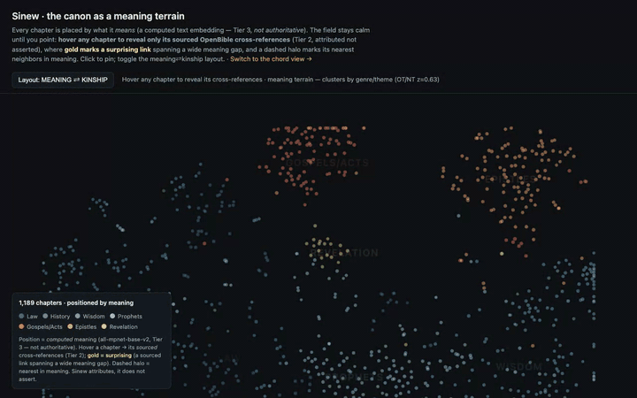

# Sinew

**An open, *sourced* database of the Bible and its internal connections** — text + canonical IDs +
versification reconciliation + cross-references, in one queryable artifact, every connection
carrying its provenance.

> *"…the sinews and the flesh came up upon them… and they lived." — Ezekiel 37:8,10*
> Sinew is the connective tissue of the canon: the layer that links verse↔verse with provenance,
> so others build on reconnected Scripture instead of feeding a PDF to an AI.

[](https://huggingface.co/datasets/LucasGalhardoLima/sinew)
[](https://huggingface.co/spaces/LucasGalhardoLima/sinew-explorer)
[](LICENSE)

**[🔭 Open the live explorer →](https://huggingface.co/spaces/LucasGalhardoLima/sinew-explorer)** — navigate the canon by *meaning*; hover any chapter to reveal its sourced cross-references. &nbsp;**[🗃️ Get the dataset →](https://huggingface.co/datasets/LucasGalhardoLima/sinew)**

[](https://huggingface.co/spaces/LucasGalhardoLima/sinew-explorer)

> A **gold** link is a sourced cross-reference that's *right yet surprising* — it connects chapters far apart on the meaning terrain. Toggle **meaning ⇄ kinship** to watch those long arcs collapse.

## Why

Anyone building on the Bible (study apps, sermon tools, AI agents, research) re-does the same
foundational work — text parsing, canonical IDs, versification reconciliation, cross-reference
lookup — and worse, **derives connections from text similarity, which is itself an interpretive
assumption** (similarity ≠ connection). Sinew separates **fact from interpretation**: every
connection is `type + source + weight`, the dataset *attributes, never asserts*, and nothing is
silently dropped. v1 is entirely **public-domain text + CC-BY data** → frictionlessly redistributable.

## The three tiers (never blurred)

- **Tier 1 — Facts:** verse text, canonical IDs, book metadata, versification map.
- **Tier 2 — Sourced connections:** every edge has `type + source + weight (+ review_status)`.
- **Tier 3 — Derived (optional):** computed embeddings/similarity, *"computed, not authoritative."*
  Powers the meaning-terrain view; built opt-in (`make embed`), kept in `derived_*`, never joined to facts.

## What's in v1

| | |
|---|---|
| **Text** | World English Bible (WEB), public domain, 31,095 verses / 1,189 chapters / 66 books |
| **Canonical IDs** | `Book.Chapter.Verse` (e.g. `John.3.16`), **eng/KJV** numbering base |
| **Versification** | `eng` (identity) + `org` (Hebrew) per verse, via the Copenhagen Alliance spec |
| **Connections** | OpenBible cross-references → **613,998** Tier-2 edges (`type=cross_reference`, `weight=votes`) |
| **Distribution** | `sinew.sqlite` + Parquet, reproducible pinned build, validation suite |

Two surfaces ship on top of the dataset: a read-only **MCP server** (grounded agent queries) and a
**telescope visualization** — two linked views, a **meaning terrain** (Tier-3, opt-in) and a **chord
diagram**, the canon connecting to itself. See below.

**Roadmap (P1, de-risked spikes, not in v1):** typed NT→OT quotations (Turpie 1868, classified
A–E); deeper Tier-3 semantic search / discovery; original-language (Macula) lemma/morphology; more
PD translations + multilingual alignment. *(The Tier-3 meaning-terrain map already ships as an
opt-in view — see [Visualize](#visualize-the-telescope).)*

## Schema

See [`docs/schema.md`](docs/schema.md) for the full data dictionary. Tables:

- **`verses`** — `verse_id (PK)`, `book`, `chapter`, `verse`, `canonical_order`, `tier=1` *(stable, translation-independent address)*
- **`books`** — `book (PK)`, `name`, `testament`, `book_number`, `chapter_count`
- **`texts`** — `verse_id`, `translation`, `text`, `tier=1` *(PK `verse_id+translation`; v1: WEB only)*
- **`versification_map`** — `verse_id`, `scheme ∈ {eng,org}`, `scheme_ref`, `status ∈ {present,merged,split}`, `tier=1`
- **`connections`** — `source_verse_id`, `target_verse_id`, `type`, `source`, `weight`, `confidence`, `review_status`, `turpie_class (NULL in v1)`, `tier=2`
- **`dataset_meta`** — `key`, `value` *(version, build date, source pins, license, base scheme)*

**Rules:** no `connections` row without `source`; endpoints reference the canonical **address**
(`verses.verse_id`), never a `texts` row; derived data would live only in `derived_*` tables.

### Canonical IDs & versification

`verse_id` uses **eng/KJV** numbering — what both inputs (WEB, OpenBible) use and what most
developers cite, so it is identity-mapped (fewest error sites). The Hebrew/original (`org`)
reference for every verse is one join away in `versification_map`, so nothing is lost and Hebrew
alignment (and P1 original-language) is ready. The reconciler resolves every protocanonical
divergence (verified in tests): Joel `eng 2:32 → org 3:5`, Malachi `eng 4:5 → org 3:23`, Psalm
superscription shifts (`Ps 51:1 → org 51:3`), chapter-boundary shifts, etc. *LXX numbering is a P1
addition (needed mainly by the quotation layer).*

### Connections

OpenBible cross-reference votes, imported as directed `cross_reference` edges with `weight=votes`.
`To`-verse **ranges are expanded** into atomic verse→verse edges. Endpoints are validated against
the verse set; an edge whose endpoint doesn't resolve (≈311, versification gaps) is **flagged in
`review_status` (`unresolved_*`), never dropped** — the "no silent failure" guarantee.

## Usage

```python
import sqlite3
con = sqlite3.connect("sinew.sqlite")

# text of a verse
con.execute("SELECT text FROM texts WHERE verse_id='John.3.16'").fetchone()

# its strongest cross-references (with provenance)
con.execute("""SELECT target_verse_id, source, weight FROM connections
               WHERE source_verse_id='John.3.16' AND review_status='ok'
               ORDER BY weight DESC LIMIT 5""").fetchall()

# Hebrew (org) numbering for an eng verse
con.execute("SELECT scheme_ref FROM versification_map WHERE verse_id='Joel.2.32' AND scheme='org'").fetchone()
# -> ('Joel.3.5',)
```

Parquet (`dist/parquet/*.parquet`) loads in pandas/duckdb/polars for analytics.

## MCP server (grounded agent queries)

A thin, **read-only** MCP server lets an agent query *sourced, attributed* connections instead of
hallucinating them. Every connection it returns carries its provenance (`source + weight +
review_status`) — connections are **attributed, not asserted** ("OpenBible lists this with N votes").
It makes no network calls and operates entirely on the local dataset.

```bash
pip install -e ".[mcp]"     # optional extra (Python ≥3.10); core install stays pyarrow-only
make mcp                    # or: sinew-mcp   (stdio transport)
```

Point a client at it (Claude Desktop / Claude Code `mcpServers`):

```json
{ "mcpServers": { "sinew": { "command": "sinew-mcp", "env": { "SINEW_DB": "/abs/path/dist/sinew.sqlite" } } } }
```

Tools — `get_verse` and `reconcile_reference` are **Tier 1** (facts); `get_cross_references`,
`get_back_references`, `get_path` are **Tier 2** (sourced); `search_text` is **lexical**, not semantic:

| tool | returns |
|---|---|
| `get_verse(verse_id)` | canonical address, WEB text, book metadata |
| `get_cross_references(verse_id, min_weight=0, limit=20, include_unresolved=False, type=None, source=None)` | verses it cites, by weight desc, each with provenance |
| `get_back_references(verse_id, …)` | verses that point **at** it, same shape |
| `reconcile_reference(verse_id, scheme='org')` | its reference under another versification scheme (e.g. `Joel.2.32` → org `Joel.3.5`) |
| `search_text(query, limit=20)` | **lexical** substring match over WEB text |
| `get_path(from, to, max_hops=3)` | shortest sourced-edge path (bounded/best-effort), each hop with provenance |

`type` and `source` are first-class facets, so a future `quotation` type or `derived_*` source is a
new facet value, not a new tool. Resolved (`ok`) edges only by default; opt in with
`include_unresolved=True` — unresolved edges are surfaced flagged, never coerced to `ok`.

## Visualize (the telescope)

```bash
make viz          # export -> dist/viz/ (open dist/viz/index.html for the hero, file:// is fine)
make viz-serve    # serve dist/viz/ so click-to-drill-down works -> http://localhost:8000
```

Two linked views (each works offline; `make viz` needs **no** ML deps — it reads the precomputed
`meaning.json`):

- **`index.html` — meaning view (hero).** Every chapter is placed by what it *means* (a computed text
  embedding — **Tier 3, not authoritative**). The field is **calm by default — no arcs**; **hover a
  chapter to reveal only its sourced cross-references** (Tier 2), coloured teal→gold by meaning-distance
  so a **gold link is *surprising*** (a sourced connection that's right yet spans a wide meaning gap),
  with a dashed halo on its nearest meaning-neighbors; everything else dims. Click to pin. A
  **meaning⇄kinship** toggle re-lays-out the same chapters from the cross-ref graph (OT/NT separation
  z≈0.6 in meaning vs ≈1.7 in kinship — the terrain clusters by genre/theme, not Testament).
- **`chord.html` — radial chord diagram.** The 66 books on a ring; the default view isolates the
  ~129k **cross-Testament** arcs. Click a book to drill into its verse-level links; hover any arc to
  read **both** verse texts and its provenance. D3 is **vendored and pinned** (`sources.lock.json`).

Both honor *attribute-never-assert*: only `review_status='ok'` Tier-2 edges are authoritative, and
the terrain's positions are explicitly labelled *"computed, not authoritative."*

### Building the meaning layer (Tier-3, opt-in)

The view's data is produced by an **opt-in** step that needs heavier deps, and is committed as a small
artifact (`src/sinew/viz/data/meaning.json`, a few hundred KB) so the viz itself stays ML-free:

```bash
pip install -e ".[embed]"   # sentence-transformers + scikit-learn + numpy (optional extra)
make embed                  # reads dist/sinew.sqlite -> meaning.json + Tier-3 derived_* tables
```

It embeds every WEB verse (`all-mpnet-base-v2`), mean-pools to chapter vectors, lays out the meaning
(t-SNE) and kinship (spectral) terrains, and records **each chapter's top-K sourced cross-references +
nearest meaning-neighbors** for the on-hover reveal. It also writes additive `derived_*` tables
(`derived_meta` / `_chapter_layout` / `_chapter_vec` / `_surprising` = the most surprising sourced
links by `log1p(votes) × cos_distance`, all `tier=3`) for local/power use — **never joined to the
Tier-1/2 fact tables**.
Embeddings/t-SNE are not byte-stable across ML builds, so `meaning.json` (model id pinned,
`random_state=0`) is the committed source of truth and is **excluded from the core dataset's
byte-for-byte reproducibility claim**.

## Build & reproduce

```bash
python -m venv .venv && . .venv/bin/activate
pip install -e ".[dev]"
make fetch      # verify raw inputs match the pinned sha256 in sources.lock.json
make build      # data/raw -> dist/sinew.sqlite + dist/parquet/
make validate   # P0 checks: every verse has text, endpoints resolve-or-flagged, fixtures pass
make test       # pytest
```

The build reads only the pinned `data/raw/` inputs and writes sorted rows, so it reproduces the
data byte-for-byte. `make fetch --download` re-pulls from upstream and reports any drift.

## Sources & licenses

| Source | Provides | License |
|---|---|---|
| [World English Bible](https://ebible.org/web/) (via getbible.net v2) | PD English text | Public Domain |
| [Copenhagen Alliance versification](https://github.com/Copenhagen-Alliance/versification-specification) | eng/org/lxx ↔ org mappings | CC-BY / open |
| [OpenBible.info cross-references](https://www.openbible.info/labs/cross-references/) | ~340k weighted edges | **CC-BY** |

**This compilation is licensed CC-BY-4.0** and **requires attribution to OpenBible.info**; the
underlying Bible text is public domain. Exact retrieval URLs + sha256 pins are in
[`sources.lock.json`](sources.lock.json) and `dataset_meta`.
